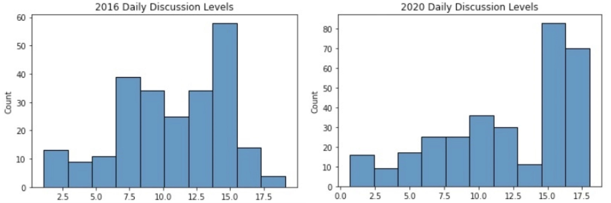

## Twitter's Impact on Elections

The rise of social media has dominated every aspect of our daily lives. In the height of the 2020 presidential election and as COVID-19 rampaged throughout the world, it facilitated increased online discussion, as well as the spread of information and misinformation. This article investigates the relationship that discussion on social media has with election outcomes. It finds that in comparing two distinct presidential elections, both of which took place as Twitter usage grew steadily, increased discussion levels were present during a Democratic win of the election.

### Inspiration

This study was motivated by recent studies investigating how Twitter might affect election outcomes. In both 2016 and 2020, Twitter was used heavily as a means of communication between representatives and constituents as well as amongst constituents themselves. Some studies have shown that social media activity such as discussion on Twitter lowered the republican vote share in 2016 by 0.2%. In close elctions, this has a significant impact. If Twitter does have an impact on voting and election outcomes, the question then becomes which way does it tend to favor. The same study suggested that it would favor the Democrats as discussion online is typically done by young, more educated, urban indivdiuals who generally vote blue. As such, in order to investigate whether this is true, we decided to track daily discussion levels in both the 2016 and 2020 elections, both of which were highly controversial, in order to detect if there was a significant difference between the discussion levels. If present, it would indicate the possibilty of discussion on social media favoring one party over another.

[Princeton Study](http://www.princeton.edu/~fujiwara/papers/Social_Media_and_Vote_Outcomes.pdf)

## Discussion Metric

In order to track activity, we constructed a measure of activity referred to as the level of discussion:  
 

For each unique day in the datasets, 2016 and 2020, we aggregated the total number of likes and retweets for each day. This was then transformed using the natural logarithm in order to eliminate skewness and preserve information. Only retweets and likes were taken into account in this analysis as comments proved substantially harder to retreive for each tweet due to the way Twitter stores its information.

## Distribution of Discussion levels

What we see here, is a difference in the distribution of daily discussion levels. The 2016 election's discussion levels by day seem more more normally distributed in comparison the 2020 election's discussion levels - at least visually. This was our first indication that the study which inspired this investigation may have had concrete results.

## Significance of Difference

TODO

## Summary
